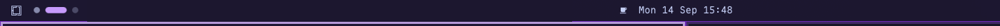

# 🗂️ Ubuntu Workspaces (`mush.workspaces`)

A dynamic Ubuntu & GNOME-inspired pill-and-dots workspace indicator for the [Omarchy](https://omarchy.org/) status bar ([Quickshell](https://quickshell.outfoxxed.me/) / Hyprland).



---

## ✨ Features

- **💫 Ubuntu / GNOME Aesthetic**: The focused workspace expands into a sleek rounded pill indicator, while inactive workspaces sit cleanly as minimal circular dots.
- **⚡ Dynamic Workspace Scaling**: Emulates Ubuntu and GNOME dynamic workspaces by automatically maintaining an empty workspace ahead of your current windows without cluttering the bar with fixed, empty placeholders.
- **🎨 Theme-Synced Accent**: Seamlessly inherits your active Omarchy theme's accent color (`Color.accent`), or can be customized to match the bar's foreground text or custom hex colors.
- **🔄 Fluid Declarative Transitions**: Native cubic easing animations for pill expansion, dot scaling, opacity transitions, and color morphing.
- **🧭 Horizontal & Vertical Bar Support**: Adapts automatically whether your Omarchy status bar is placed horizontally (top or bottom) or vertically (left or right).
- **🖱️ Interactive Navigation**:
  - **Left-Click** any dot or pill to instantly switch to that workspace.
  - **Scroll Wheel** anywhere over the widget to cycle through previous and next workspaces.
- **💬 Window Count Tooltips**: Hovering over any workspace displays its index and live window count (e.g. `Workspace 2 • 3 windows`).
- **🔢 Optional Workspace Numbers**: Toggle workspace index labels (`0`–`9`) inside the active pill and dots.
- **🚀 Zero Dependencies & Ultra Lightweight**: Pure declarative QML integrating directly with `Quickshell.Hyprland` with zero background polling loops or external daemons.

---

## 📦 Installation

### Option 1: Via Omarchy CLI (Recommended)

Add and enable the plugin using the Omarchy CLI:

```bash
omarchy plugin add https://github.com/m7sh/mush.workspace.git --enable
```

### Option 2: Manual Clone

Clone this repository into your Omarchy plugins directory:

```bash
git clone https://github.com/m7sh/mush.workspace.git ~/.config/omarchy/plugins/mush.workspaces
```

Add the widget to your bar layout in `~/.config/omarchy/shell.json`:

```json
{
  "bar": {
    "layout": {
      "left": [
        { "id": "omarchy.menu" },
        { "id": "mush.workspaces" }
      ]
    }
  }
}
```

Then reload the shell:

```bash
omarchy restart shell
```

---

## ⚙️ Configuration

You can customize the widget in `~/.config/omarchy/shell.json` under the `mush.workspaces` entry:

```json
{
  "id": "mush.workspaces",
  "dynamic": true,
  "minWorkspaces": 2,
  "maxWorkspaces": 10,
  "dotSize": 7,
  "pillWidth": 24,
  "spacing": 6,
  "showNumbers": false,
  "style": "theme"
}
```

### Configuration Options

| Option | Type | Default | Description |
| :--- | :--- | :--- | :--- |
| `dynamic` | Boolean | `true` | Enables dynamic workspace scaling (automatically creates/shows an empty next workspace). |
| `minWorkspaces` | Number | `2` | Minimum number of workspace dots to display on the bar. |
| `maxWorkspaces` | Number | `10` | Maximum number of workspace dots allowed. |
| `dotSize` | Number | `7` | Diameter of inactive workspace dots (in pixels). |
| `pillWidth` | Number | `24` | Width / length of the active workspace pill (in pixels). |
| `spacing` | Number | `6` | Pixel spacing between adjacent workspace dots and the pill. |
| `showNumbers` | Boolean | `false` | When `true`, displays workspace index numbers inside the dots and active pill. |
| `style` | String | `"theme"` | Color style preset: `"theme"` (uses active theme accent), `"foreground"` / `"gnome"` / `"white"` (uses foreground text color). |
| `activeColor` | String | `""` | Custom color override for the active pill (e.g. `"#a855f7"`, `"accent"`, `"foreground"`, or `"white"`). |

---

## 🎮 Controls

| Action | Control |
| :--- | :--- |
| **Switch Workspace** | Left-Click on any workspace dot or pill |
| **Previous Workspace** | Scroll Wheel Up / Left |
| **Next Workspace** | Scroll Wheel Down / Right |
| **Inspect Windows** | Hover over any dot/pill for window count tooltip |

---

## 🗑️ Removal

To disable the widget:

```bash
omarchy plugin disable mush.workspaces
```

To completely uninstall and remove the plugin:

```bash
omarchy plugin remove mush.workspaces
```

Or manually remove `{ "id": "mush.workspaces" }` from `~/.config/omarchy/shell.json`, delete the `~/.config/omarchy/plugins/mush.workspaces` directory, and run `omarchy restart shell`.

---

## 📋 Requirements

- [Omarchy Linux](https://omarchy.org/) (Hyprland + Quickshell)
- No external runtime packages or build steps required.

---

## 📄 License

[MIT License](LICENSE) © 2026 mush
